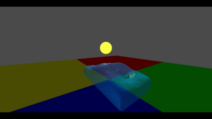

### Particle Fluid Simulation using Smoothed Particle Hydrodynamics

This simulation is built in **Godot 4.4**, utilizing a custom implementation of **Smoothed Particle Hydrodynamics** as well as **compute shaders** to model fluid behavior with high performance.

---

### 2D Demo: Speed-Based Coloring  
Particles are color-coded based on their speed.

---

### 3D Demo: Light Interaction
Particles respond to simulated sunlight, creating depth and a more realistic look.

---
#### References:
- https://github.com/SebLague/Fluid-Sim
